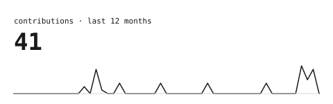
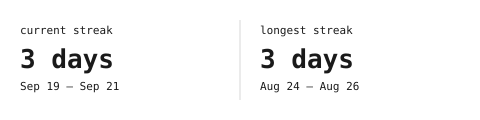
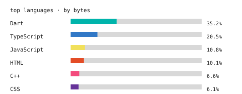
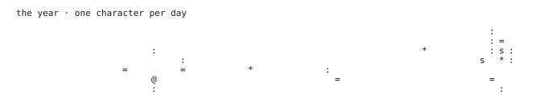

<!--
  This README pulls zero third-party widgets. portrait.svg was generated
  once, locally, from a source photo (see the ASCII Portrait README Guide).
  stats.svg, streak.svg, langs.svg and year.svg are regenerated nightly by
  .github/workflows/refresh-stats.yml from this repo's own
  scripts/generate_stats.py.
-->

# Hishaam

I build software end to end — from interface down to infrastructure. Most comfortable owning a product from the first line of code to the people using it.

 

 

> Updated automatically, nightly — no external services, no rate limits.

---

Graphics generated in this repo — see <a href="scripts/generate_stats.py">scripts/generate_stats.py</a>. Font: JetBrains Mono, SIL OFL 1.1.